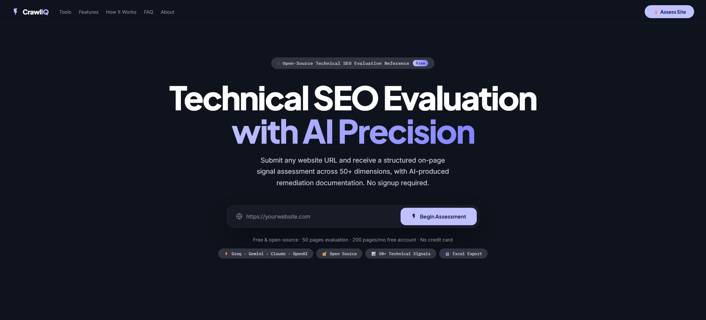
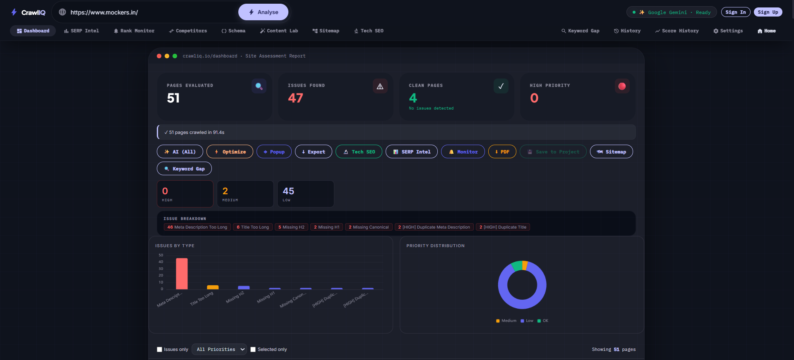
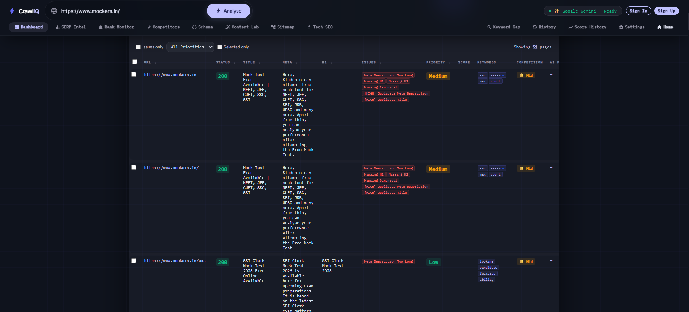
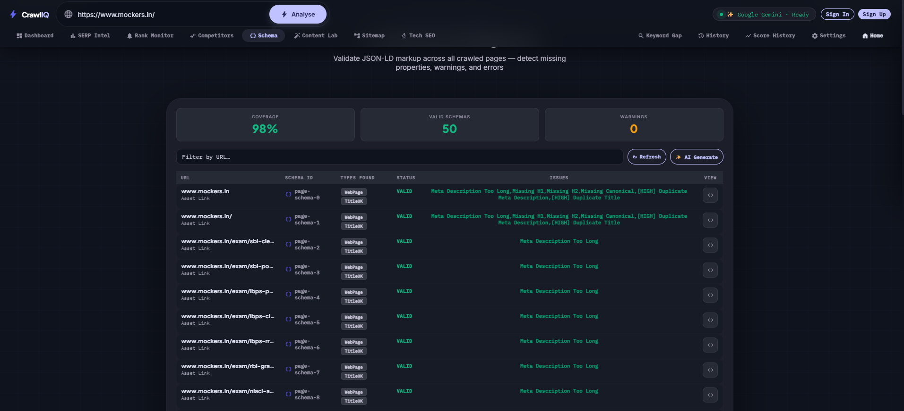

<div align="center">

# CrawlIQ

### Technical SEO Evaluation with AI Precision

**Submit any URL. Get a 50+ dimension technical audit and AI-generated remediation in under two minutes. No signup. No paywall.**

[](https://python.org)
[](https://fastapi.tiangolo.com)
[](https://huggingface.co/spaces/bhavani7/seo-project)
[](https://github.com/Bhavani5A8/crawliq.io/blob/main/LICENSE)
[](https://bhavani5a8.github.io/crawliq.io/)

[**Live Demo**](https://bhavani5a8.github.io/crawliq.io/) · [**Backend**](https://huggingface.co/spaces/bhavani7/seo-project) · [**Report a Bug**](https://github.com/Bhavani5A8/crawliq.io/issues) · [**LinkedIn**](https://www.linkedin.com/in/teki-bhavani-shankar-seo-professional/)

</div>



---

## Why CrawlIQ exists

Screaming Frog charges £259/year. SEMrush starts at $139/month. Surfer SEO is $89/month. For SEOs without enterprise budgets — interns, freelancers, small agencies, in-house teams at startups — the tools that diagnose technical SEO issues sit behind a wall.

**CrawlIQ is the same audit depth, delivered free.** It's a Python async crawler with multi-model AI on top: 50+ technical signals per page, structured Excel and PDF reports, and paste-ready content fixes from your choice of Groq, Gemini, OpenAI, or Claude.

If you can read a URL, you can run a full technical audit. That's the entire product.

---

## See it in action

### One URL in. Full site audit out.



51 pages crawled in 91.4 seconds. 47 issues surfaced and grouped by severity. Two visualizations — issues by type, priority distribution — render automatically. One click exports the lot to Excel.

### Per-page diagnostics that match what Screaming Frog shows you



Every crawled URL gets its own row. Status codes, title length, meta description, H1 presence, issue tags, priority weighting, score, extracted keywords, and competitor flags — all sortable, filterable, exportable.

### Schema.org validation across the entire site



JSON-LD coverage at a site level. Validates every page's structured data, flags missing properties, generates schema with AI when gaps appear. Most paid tools charge for this as an add-on.

---

## Features

### Technical SEO Audit
- Per-page technical score (0–100) with letter grade (A–F)
- HTTP status analysis (200, 3xx, 4xx, 5xx)
- Indexability assessment — noindex, canonical mismatch, robots.txt blocked
- robots.txt and sitemap.xml validation
- Canonical URL conflict detection
- Redirect chain detection
- Core Web Vitals integration
- Crawl budget analysis with internal link graph

### On-Page SEO
- Title tag audit — missing, too short (<30), too long (>60)
- Meta description audit — missing, duplicate, length
- H1/H2/H3 heading structure analysis
- Open Graph and Twitter Card coverage
- Image alt text audit
- Thin content detection (<300 words)
- Keyword extraction with TF-IDF scoring

### AI-Powered Remediation
- Multi-model support: Groq (Llama 3), Gemini 1.5, OpenAI GPT-4o, Claude
- Paste-ready optimized titles, meta descriptions, H1s
- Live Optimization Table — edit, regenerate, export

### Competitor & SERP Intelligence
- Side-by-side technical comparison against any competitor URL
- Keyword gap analysis
- SERP position tracking and rank monitoring

### Reporting
- Excel export (.xlsx) — full report, issues report, optimization table, technical audit
- Per-page PDF export
- Schema.org structured data validator and generator

---

## Tech Stack

| Layer | Technology |
| --- | --- |
| Backend | Python 3.11, FastAPI, aiohttp |
| Crawling | aiohttp async BFS crawler, Playwright (optional JS rendering) |
| AI Analysis | Groq (Llama 3), Gemini 1.5, OpenAI GPT-4o, Claude |
| Frontend | Vanilla HTML/CSS/JS — zero framework dependencies |
| Deployment | HuggingFace Spaces (Docker), GitHub Pages |
| Storage | SQLite (session) |

---

## Quick Start

### Run locally

```bash
# 1. Clone
git clone https://github.com/Bhavani5A8/crawliq.io.git
cd crawliq.io

# 2. Virtual env
python -m venv venv
source venv/bin/activate   # Windows: venv\Scripts\activate

# 3. Install
pip install -r backend/requirements.txt

# 4. (Optional) API keys for AI features
export GROQ_API_KEY=gsk_...
export GEMINI_API_KEY=AIza...
# Or create backend/.env

# 5. Run
cd backend
python main.py
```

App runs at `http://localhost:7860`. API docs at `http://localhost:7860/docs`.

### Environment variables

| Variable | Description | Required |
| --- | --- | --- |
| `GROQ_API_KEY` | Groq API key (generous free tier) | Optional |
| `GEMINI_API_KEY` | Google Gemini API key | Optional |
| `OPENAI_API_KEY` | OpenAI API key | Optional |
| `ANTHROPIC_API_KEY` | Anthropic Claude API key | Optional |
| `APP_BASE_URL` | Public URL for redirect callbacks | Optional |

> The crawler works without any AI keys. AI remediation features activate when at least one key is present.

---

## API Reference

| Method | Endpoint | Description |
| --- | --- | --- |
| `POST` | `/crawl` | Start a crawl: `{"url": "https://example.com", "max_pages": 50}` |
| `GET` | `/crawl-status` | Poll crawl progress |
| `GET` | `/results` | Fetch all crawled page data |
| `POST` | `/analyze` | Run AI analysis on crawl results |
| `POST` | `/optimize` | Generate paste-ready SEO fixes |
| `GET` | `/export` | Download Excel report (.xlsx) |
| `POST` | `/technical-seo` | Run full technical SEO audit |
| `POST` | `/competitor` | Start competitor analysis |
| `GET` | `/healthz` | Health check |

Full interactive docs available at `/docs` once the server is running.

---

## Project Structure

```
crawliq.io/
├── index.html              # GitHub Pages frontend (production)
├── backend/
│   ├── main.py             # FastAPI app + all API routes
│   ├── crawler.py          # Async BFS crawler (aiohttp)
│   ├── site_auditor.py     # Technical SEO audit engine
│   ├── seo_optimizer.py    # AI optimization pipeline
│   ├── competitor.py       # Competitor analysis
│   ├── serp_engine.py      # SERP tracking
│   ├── gemini_analysis.py  # Gemini AI adapter
│   ├── claude_adapter.py   # Claude AI adapter
│   ├── groq_adapter.py     # Groq AI adapter
│   ├── billing.py          # Stripe billing integration
│   ├── index.html          # HuggingFace frontend (served by FastAPI)
│   ├── requirements.txt
│   └── Dockerfile
├── docs/
│   └── screenshots/        # README assets
├── robots.txt
├── sitemap.xml
└── README.md
```

---

## Live Demo Notes

The hosted demo runs on HuggingFace Spaces' free tier. The backend sleeps after 48 hours of inactivity — **first load after sleep takes 30–90 seconds while the container wakes**. Subsequent requests are instant.

For production use, self-host the Docker image. The `Dockerfile` in the repo root is production-ready.

---

## Roadmap

- [ ] JavaScript rendering via Playwright for SPA support
- [ ] Hreflang validation for multi-region sites
- [ ] Log file analysis integration
- [ ] Lighthouse CI integration for automated audits
- [ ] Slack/Discord webhook for scheduled audits
- [ ] Multi-user workspaces with role-based access

Suggestions welcome — open an [issue](https://github.com/Bhavani5A8/crawliq.io/issues) or start a [discussion](https://github.com/Bhavani5A8/crawliq.io/discussions).

---

## Contributing

Contributions are welcome. The codebase is intentionally small (a few thousand lines of Python) and approachable.

1. Fork the repo
2. Create a feature branch (`git checkout -b feature/your-feature`)
3. Commit with a clear message (`git commit -m "Add hreflang validation"`)
4. Push and open a Pull Request

See [CONTRIBUTING.md](CONTRIBUTING.md) for code style, testing expectations, and how to run the audit suite locally.

---

## About the author

**Teki Bhavani Shankar** — Technical SEO Specialist based in Visakhapatnam, India.

CrawlIQ started as a tool I needed and couldn't afford. It now runs the technical audits I used to outsource to a £259/year license. Open-sourcing it because if the diagnosis is free, more people can do the work.

If you're hiring for Technical SEO, or want to talk about how CrawlIQ could fit into your workflow, I'm reachable on [LinkedIn](https://www.linkedin.com/in/teki-bhavani-shankar-seo-professional/).

[](https://www.linkedin.com/in/teki-bhavani-shankar-seo-professional/)
[](https://github.com/Bhavani5A8)

---

## License

MIT — free to use, fork, and build on. Attribution appreciated, not required.

---

<div align="center">

**If CrawlIQ saved you an audit, a star costs you nothing.**

[⭐ Star this repo](https://github.com/Bhavani5A8/crawliq.io)

</div>
